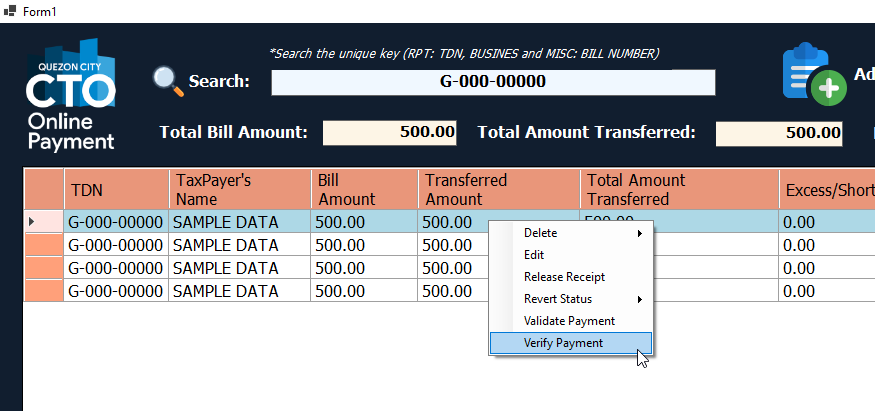

# Revised Online Payment Transaction System

- **Motivation:** 
  - I started this project with the following learning objectives:
    - Learn how to code in C#
    - Explore good engineering practices
    - Understand different technologies
    - Gain experience in stakeholder interaction
    - Learn database design principles
    - Master user interface design
    - Practice software deployment and testing
    - And more. I believe that the best way to learn coding is by actually doing it.
- **Objective:**
  - My primary goal with this project is to create a system that helps my team in the online payment department perform their duties more efficiently.

The **Revised Online Payment Transaction System** is a C# application designed to streamline the payment processing workflow within the online payment department. It facilitates the handling of various tax payments, including real property tax, business application tax, and miscellaneous taxes, by providing a comprehensive platform for monitoring payment statuses and assisting departmental staff in the tax payment process.

It's important to note that the system does not directly handle tax payments; rather, it supports departmental staff in their administrative tasks. Here's an overview of the different stages involved in tax processing:

- **Verification:** This stage involves confirming the entry of payments into the system. Staff input payment data from various sources, such as banks, GCash, and Paymaya, into the system for further processing.

- **Validation:** Once payments are verified, staff update the system to reflect the receipt of payments by the department. Verifiers cross-check payments received from other systems and update the system accordingly.

- **Encoding:** This segment of the system is dedicated to encoding tax payments received from different sources. Payments from banks and electronic platforms like GCash and Paymaya are entered into the system by departmental staff.

- **Official Receipt Issuance:** Tax collectors utilize this portion of the system to generate official receipts upon successful validation of payments. The system enables them to tag generated official receipts, indicating completion of the validation process.

- **Official Receipt Upload:** Receipts are scanned, securely stored in the database, and automatically sent to taxpayers via email through this feature. Additionally, staff update information regarding the physical storage location of receipts, facilitating easy retrieval when needed.

- **Releasing:** This module assists staff when taxpayers claim their physical receipts. The system aids in locating the group of taxes associated with a particular taxpayer and provides information on the cabinet and folder containing the physical copies for retrieval.

By efficiently managing the tax payment workflow, the **Revised Online Payment Transaction System** enhances the productivity of the online payment department and ensures smoother processing of tax payments.

## Technical Information

The codebase adheres to a structured convention, where classes are organized according to specific roles, ensuring each class maintains a singular responsibility. This design principle enhances code clarity and maintainability.

The development of this project involved a variety of elements and practices, including:

- **C#:** The primary programming language employed for development.
- **.NET 6.0:** Leveraged for its latest features and enhancements, providing a robust framework for building modern applications.
- **Winforms:** Utilized for user interface (UI) development and orchestration of system workflows.
- **Entity Framework (EF):** Employs EF as the primary Object-Relational Mapping (ORM) tool, facilitating seamless interaction with the MS SQL Server database.
- **Entity Framework LINQ:** Leveraged extensively for database queries and interactions, enhancing code readability and efficiency.
- **Raw SQL:** Employed for executing complex database queries, offering flexibility and control over data retrieval and manipulation.
- **Layered Architecture:** Adopts a layered architectural approach, segregating components into distinct layers:
  - **Winforms:** Responsible solely for UI presentation and user interaction.
  - **Services:** Implements business logic and transaction management, ensuring cohesive application behavior.
  - **DAL (Data Access Layer):** Handles database interactions, providing a separation of concerns and promoting maintainability.
- **OpenCVSharp:** Utilized for generating Excel reports, enabling efficient data visualization and analysis.
- **Integration with Gmail:** To minimize work by the staff, the system automatically sends emails to taxpayers via the SMTP protocol.
- **Copy Paste from Excel:** To add efficiency, data are sent to the department in Excel format. The system accepts pasting of those data from Excel, minimizing time and avoiding human errors.
- **Dynamic Control Generation:** To support numerous types of tax records without generating a large codebase, the system supports dynamic generation of controls.

By leveraging these technologies and adhering to sound architectural principles, the system delivers robust functionality and maintainability.

## Screenshots

Below are screenshots showcasing some of the system's high-level features.


*Login screen where users with varying roles in the department can log in.*


*Main view of the system where most staff work. Users can search for any tax number, retrieving all related taxes in the history belonging to the same taxpayer or grouping of taxes.*


*Users can perform different actions based on business scenarios and their roles.*


*Screen where users can insert a single record, choosing from a variety of tax types. The fields shown will change depending on the selected tax type.*


*Support for adding multiple records at once, increasing efficiency and handling cases where a single taxpayer pays for multiple taxes.*


*The system supports copy-pasting of data from Microsoft Excel.*


*Data can be pasted into the form as shown above, and users can save or print the data.*


*Feature allowing users to capture a screenshot of the receipt using a camera connected to the computer. This significantly reduces processing time for receipt emails, making it more convenient, quicker, and less error-prone.*


*Work in progress - the system generates various types of reports that users need to submit to different departments within the treasury.*

## Challenges in the System

Developing the system brought various challenges, tackled through innovative solutions:

- **Learning Curve:** Getting started with software development was tough. Balancing learning new technologies while solving real-world problems required continual learning and adaptability.

- **Ease of Use:** Making the system user-friendly was crucial for team efficiency. Designing an intuitive system involved streamlining workflows and improving user experience.

- **Complex Calculations:** Handling intricate tax calculations presented challenges. Navigating different scenarios required careful consideration and thorough testing.

- **Performance Optimization:** Making the system perform efficiently, especially with large data, was crucial. Optimizing performance required rigorous efforts to ensure timely data processing.

- **Good Engineering Practices:** Following good engineering practices was vital for long-term maintainability. Prioritizing code organization, readability, documentation, and testing established a solid foundation for future development.

## Code Statistics

Using `cloc`, the following statistics were generated:

```markdown
------------------------------------------------------------------------------------
Language                          files          blank        comment           code
------------------------------------------------------------------------------------
JSON                                  7              0              0          12775
C#                                   97           1131            754           7198
XML                                  15             11             48           5880
C# Designer                          12             72            562           2463
Text                                  1              0              0             84
Markdown                              1             33              0             67
MSBuild script                        1              8              0             56
Visual Studio Solution                1              1              1             23
INI                                   1              0              0             16
C# Generated                          1              4             10             11
------------------------------------------------------------------------------------
SUM:                                137           1260           1375          28573
------------------------------------------------------------------------------------
